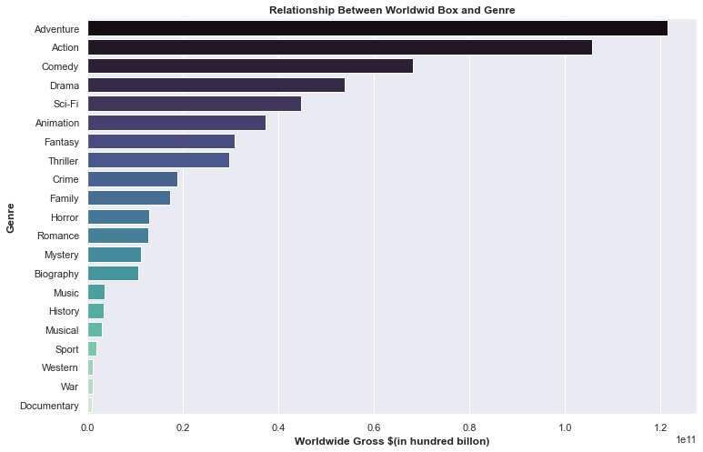

# Flatiron Phase 1 Project 1 - Microsoft Studio Movie Proposal

## Business Understanding
Industry stakeholders: Investors, Movie studios, producers and actors, distributors such as streaming platform, marketing firm, and audiences.  
The movie making industry is highly competitive. For Microsoft to break into this market, it is essential to identify key aspects of successful movie and learn from these cases. 
## Data Understanding 
The data we used in this project are from Movie Box Gross, Movie Budget, Tomato Movie, and IMDB database.
- **Movie Box Gross** provides movie titles, studios, domestic and foreign gross numbers.
- **Movie Budget** provides movie names, production budgets, domestic and worldwide sales.
- **Tomato Movie** provides movie names, voting averages, online voting counts.
- **IMDB** provides movie names, genres, actors, directors, runtimes, and ratings.

## Approach
I use exploratory data analysis to find out what would be the best movie to make for Microsoft Movie Studio. The analysis is conducted on 3 metrics:
1. Profits vs. budget 
2. Popularity vs. online exposure
3. Movie success based on genre

## Key business questions
- Does higher budget make movie more profitable?
- What factor contributes to the popularity of a movie?
- How genre affects the profitability of a movie?

## Analysis  
We found that there is a positive correlation between movie budget and profit.

We found that a movie that succeeds domestically do well internationally.

We found that higher movie budget leads to a higher online votes.

We found that online vote counts lead to a higher popularity of movie.

We found that action, adventure, comedy, drama are most profitable movie to make. 

## Conclusions
**The 1st recommendation:** we recommend Microsoft Movie Studio to make their first moview with a higher production budget  
Top 5% of movies that generated the most revenues invest $140,000,000 on average.  
**The 2nd recommendation:** Get as much exposure for the first movie. Spend at least industry average level to marketing to increase online exposure, which is directly related to the popularity of a movie.  
**The 3rd recommendation:** Make a movie across multiple genres. More genres means more exposure to different audiences. 

## Looking Forward
To further elaborate current strategy, I would like to include an analysis of macro factors.  

**Social media**  
It is an area that changing very fast and how to leverage social media to increase exposure is key for movie studios.  

**Online streaming platform**  
This Market has transformed from Netflix being No.1 to Netflix, HBO, Disney Plus and many other small ones competing. I expect the competition will only get more fierce and that would help movie studio to diversify the pipelines of revenue streams.  

**Social aspects**  
We are living in a world that is changing very fast. People could be talking totally different topics in a matter of 5 years or even 3 years. How to capture the hot topics of each time would also be a main task for every studio.

## Contact Info
Julian(Xibei) He [Github](https://github.com/JulianHe1991) [Email](mailto:julianhe1991@gmail.com)